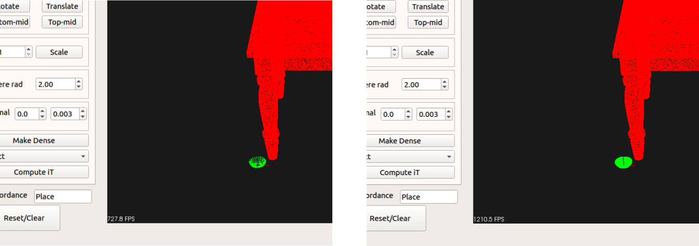
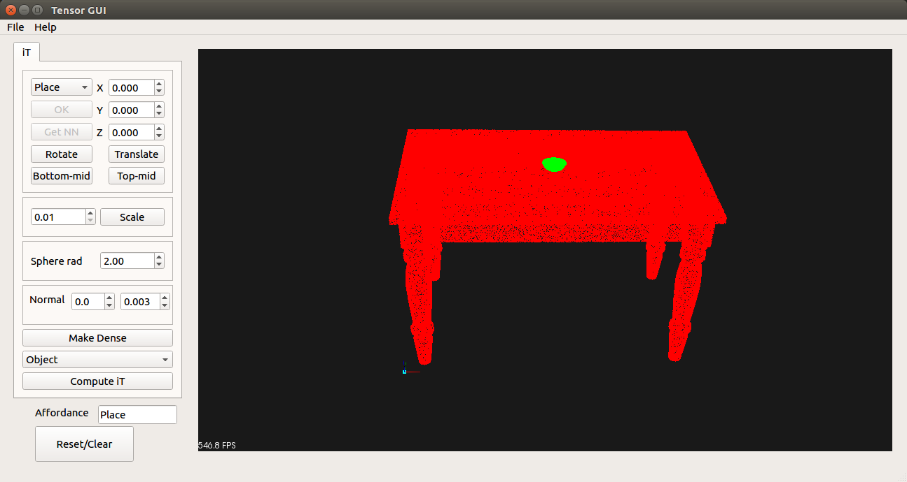

#### Computing an interaction example

In order to compute an Interaction Tensor for *training* you need to:
1. Load an object model or dense pointcloud as **scene-object**
2. Load an object model or dense pointcloud as  **query-object**
3. Place the objects simulating the intended interaction

Execute the binary to bring up the GUI. The first step is to load the scene-object (e.g. table for *placing*, faucet for *filling*, etc.). We provide the 5 scene-objects used for the interactions presented in the our paper, these objects are: table, sink, hanging-rack, motorcycle and sitting stool. You can quickly load these by selecting the associated interaction from the drop-down menu on the upper left area.

The scene-object will be displayed in red (pointcloud) and the a test-point will be selected (manually set). 

This test-point is only a guidance to align or place the objects simulating the interactions.
For instance in the case of a table the test-point is set to the center on top of the table, or in case of a motorbike it would be the center on top of the saddle. You can choose a different test-point by selecting a point over the table (left click on mouse while holding shift). A second way of selecting a test-point is by using the bottom-mid and top-mid buttons, these will select the center (top or bottom)
point of the bounding box of the current object/pointcloud. As an example, when the table has been loaded clicking bottom-mid will select a point "on the floor" in middle of the table legs.

If you manually selected a test-point you will need to confirm your selection by clicking the **OK** button on the upper left.

You can also load your own CAD model (PLY/OBJ files) or pointcloud (PCD file) using the File menu: **File -> Load**. Make sure your model/pointcloud meets the following criteria:
  * Model/pointcloud is oriented correctly, our framework assumes the gravity vector along the negative part of Z axis. 
  * Scene-object needs '*scene-*' as base name. Have a look at the data directory for examples of such naming convention.

Given that CAD models are usually not dense, once you have loaded your model into the GUI, you can click on the **Make dense** button in order to obtain a dense pointcloud (300000 points uniformly sampled for scene-object). Whereas the number of points is fixed in the code, you can change it easily by having a look at the *denseButtonPressed()* function in src/mainwindow.cpp

A similar process is followed to load a query-object and get a dense pointcloud. Once we have a dense pointcloud you need to also chose a test-point for this object, as explained before this will be use as guide to place the two objects closer together (interaction simulation). As an example we'll load a bowl model located under data/ directory (bowl.ply). You'll notice this is model is not dense, therefore click on **Make dense** button to get a dense pointcloud. 

Next, we need to place this object on top of the table (for *Placing* affordance). To achieve this we need to select a test-point on this bowl that will be align with
the test-point from the table (middle point on top table). You can either manually select a point on the base of the bowl or use the "bottom-mid" button. If you selected the point manually remember that you will have to confirm by pressing the "OK" button. Once a test-point as been selected click on "Translate" button, this will apply a transformation to the query-object pointcloud (bowl) in order to place it on top of the table. Under the hood, what the code does is computing the translation required to go from test-point on the query-object to the test-point on the scene-object.

Notice how the text-box with the label "Affordance" was automatically filled with **Place** since we selected from the beginning this affordance. You can change the name of the affordance if you wish or if the interaction you are simulating is different.

The final step at this point is to click on **Compute iT** button which will compute the interaction tensor, sample affordance keypoints uniformly and based on weights and produced a lot of auxiliary files. Some of which are needed in order to make predictions at test time.
### Affordance prediction with the Interaction Tensor

In order to predict affordance location candidates with the interaction tensor follow the guide [here](../Testing/README.md)